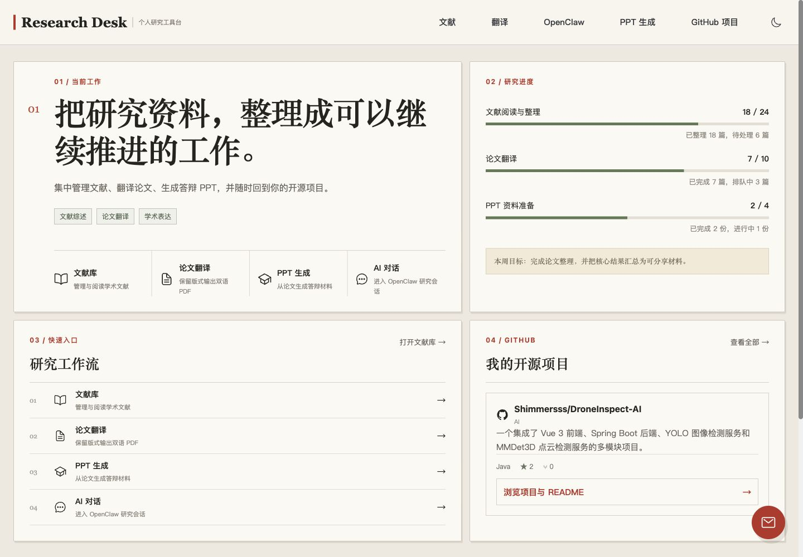
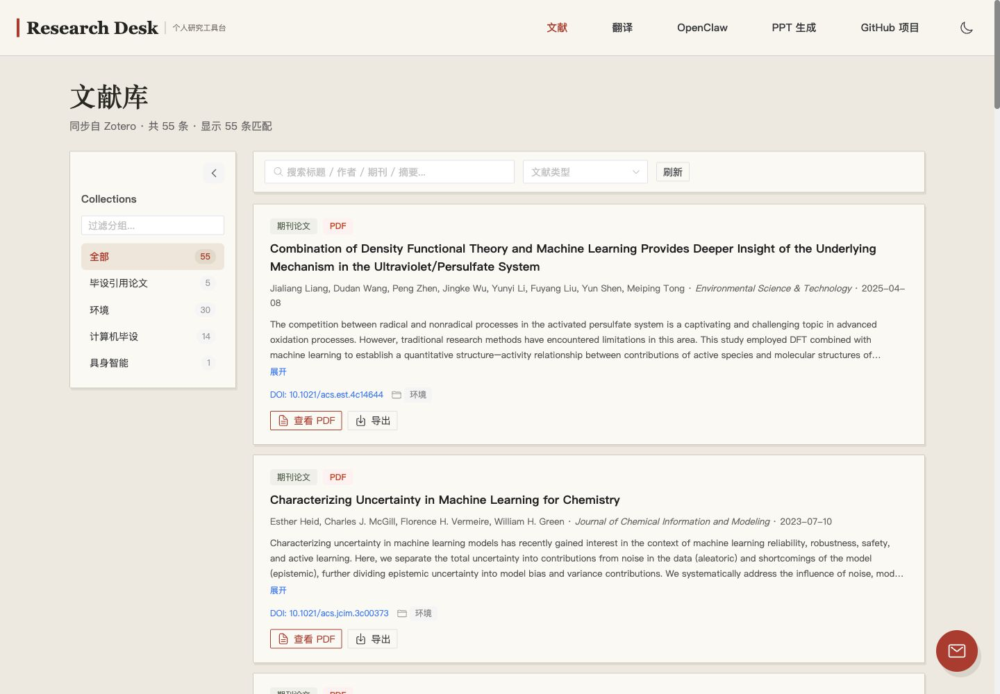
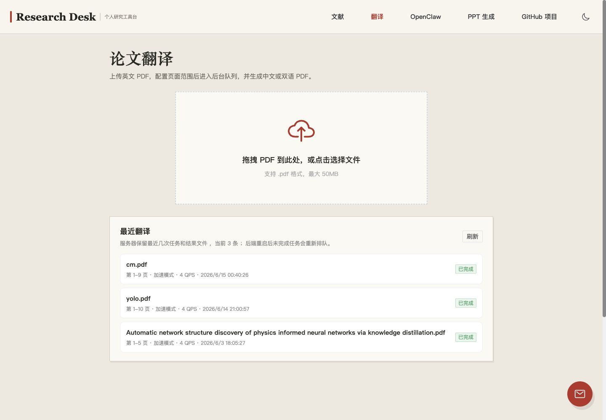
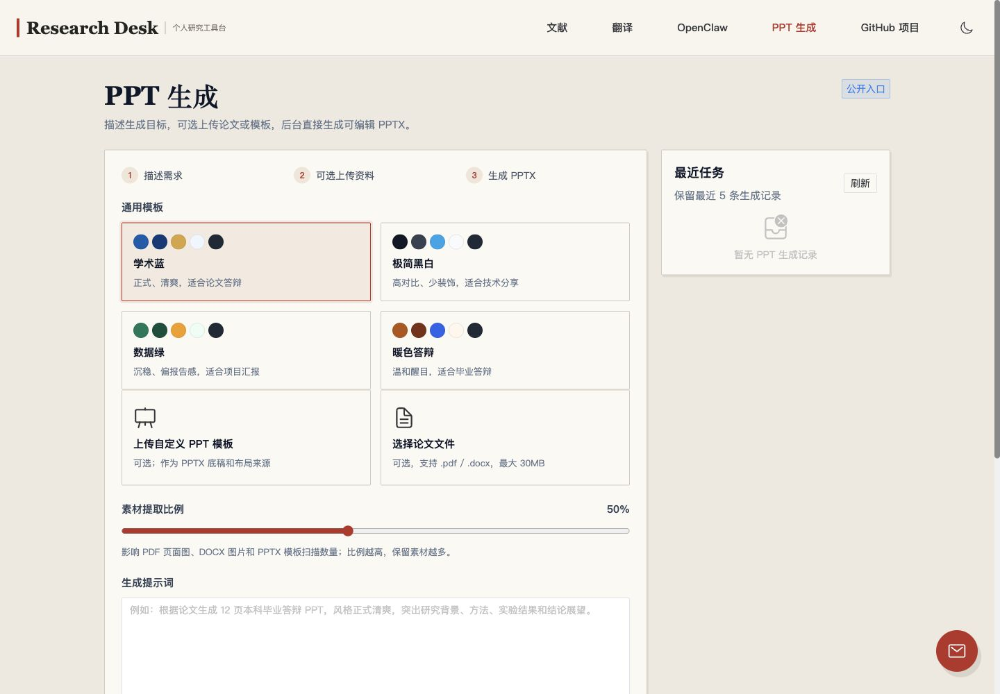
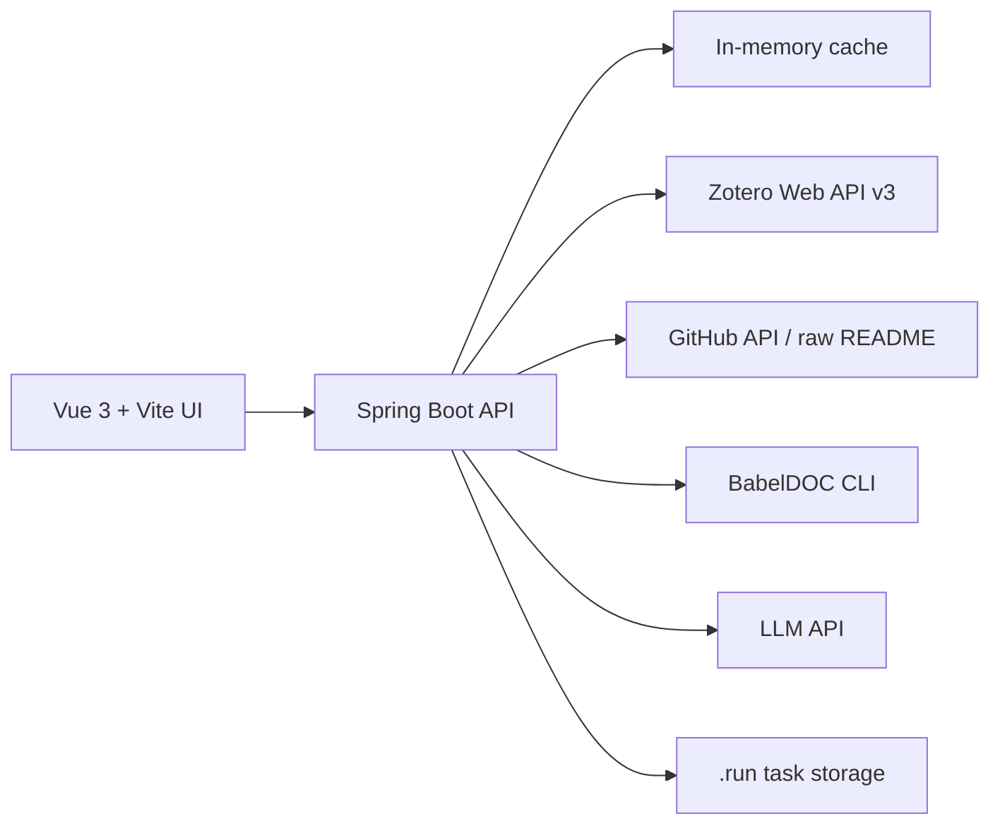

# Research Workbench / 研究工具台

一个面向个人研究流程的全栈工具台，整合 Zotero 文献库、论文 PDF 翻译、论文到 PPT 生成和 GitHub 项目展示。

A full-stack personal research workbench that brings together a Zotero library browser, PDF paper translation, paper-to-PPT generation and GitHub project showcases.



## 功能 / What It Does

- **文献库展示 / Zotero library**：后端从 Zotero Web API 拉取私有文献库，启动预热并缓存；前端按 collection、关键词和附件状态浏览。
- **附件代理 / Attachment proxy**：PDF、Markdown 和网页快照附件统一由后端代理，支持 Zotero S3 跳转、ZIP 附件解包、流式传输和真实下载进度。
- **PDF 论文翻译 / PDF translation**：上传 PDF 后选择页码范围、字体族和速度模式，由后端排队调用 BabelDOC 生成保留版式的纯中文 / 双语 PDF。
- **PPT 生成 / Paper to PPT**：根据提示词、论文文件和可选 PPTX 模板生成答辩或汇报材料，支持论文图片抽取、视觉筛选和模板原生填充。
- **GitHub 项目展示 / GitHub showcase**：前端只访问站内接口，后端代理 GitHub API 和 README raw 内容，避免浏览器直连外部接口。

## 截图 / Screenshots

### Zotero Publications / Zotero 文献页

文献页聚合 Zotero 条目、collection、标签、附件和引用导出。PDF 附件按需下载，避免一次性占用浏览器和 JVM 内存。

The publications page combines Zotero items, collections, tags, attachments and citation export. PDF attachments are downloaded on demand to keep browser and JVM memory usage bounded.



### PDF Translation / PDF 翻译

翻译页采用上传、配置、翻译中、结果预览四态流程。BabelDOC 负责保留论文版式、图片和公式位置。

The translation view follows a four-state flow: upload, configure, translate and preview results. BabelDOC preserves layout, images and formula positions.



### Paper To PPT / 论文转 PPT

PPT 生成页支持提示词、论文和 PPTX 模板组合输入。任务在后端单 worker 队列中运行，完成后下载可编辑 `.pptx`。

The PPT generator accepts prompts, papers and optional PPTX templates. Jobs run in a single backend worker queue and produce editable `.pptx` files.



## 架构 / Architecture



浏览器只访问 `/api/*`。外部服务、CLI 调用、文件下载、鉴权、队列和资源限制都放在后端。

The browser only talks to `/api/*`. External services, local CLIs, file downloads, authentication, queues and resource limits live in the backend.

## 技术栈 / Tech Stack

| Layer / 层 | Stack / 技术 |
| --- | --- |
| Frontend / 前端 | Vue 3, Vite, Naive UI, Pinia, Vue Router |
| Backend / 后端 | Spring Boot 3, Java 17 |
| Documents / 文档处理 | PDFBox, BabelDOC, python-pptx, Docling / MarkItDown fallback |
| Data Sources / 数据源 | Zotero Web API v3, GitHub API |
| Runtime / 运行 | macOS/Linux shell scripts, root `.env.local`, disk-backed task storage |

## 仓库结构 / Repository Layout

```text
backen/                  Spring Boot backend (package: com.web.backen)
front/                   Vue 3 frontend
project.sh               local start / stop / status helper
README.md                bilingual public project overview
GIT_UNTRACK_GUIDE.md     detailed Git untracking guide
```

> 后端目录名故意保留为 `backen`，Java 包名是 `com.web.backen`。不要改成 `backend`。
>
> The backend directory is intentionally named `backen`; the Java package is `com.web.backen`.

## 本地开发 / Local Development

Requirements / 环境要求：

- Java 17
- Node.js + npm
- `uv` for BabelDOC / Python helper commands

```bash
# create root .env.local locally, using the variables listed below
./project.sh start
```

Open / 打开：

- Frontend / 前端：`http://localhost:3000`
- Backend / 后端：`http://localhost:8080`

Useful commands / 常用命令：

```bash
./project.sh status
./project.sh restart backend
./project.sh logs backend
./project.sh stop
```

## 配置 / Configuration

密钥从根目录 `.env.local` 读取，该文件不会提交到 Git。之前提交过的 `front/.env*` 已经取消跟踪；当前构建和运行不依赖这些前端环境文件。

Secrets are loaded from root `.env.local`, which is ignored by Git. Previously committed `front/.env*` files have been removed from Git tracking; the current build and runtime flow do not require them.

Important groups / 主要配置组：

- `ZOTERO_API_KEY`, `ZOTERO_USER_ID`
- `ADMIN_KEY`
- `LLM_*`
- `BABELDOC_*`
- `PPT_GENERATION_*`
- `ROOT_USERNAME`, `ROOT_PASSWORD`
- `DB_URL`, `DB_DRIVER`, `DB_USERNAME`, `DB_PASSWORD` for production MySQL

真实 API key 和部署参数必须放在仓库外。根目录 `.env.local.example` 只保留空值/占位符，可作为部署配置清单；不要提交真实 `.env.local`。

Keep real API keys and deployment parameters outside the repository. The root `.env.local.example` only contains blank placeholders and can be used as a deployment checklist; never commit a real `.env.local`.

## 资源基线 / Resource Baseline

生产目标环境是 **2 核 CPU / 4 GB 内存**。长任务使用有界队列、单 worker 文档生成、磁盘任务文件、流式附件传输和保守并发默认值。

The production target is modest: **2 CPU cores / 4 GB RAM**. Long-running work uses bounded queues, single-worker document generation, disk-backed task files, streaming attachment transfer and conservative concurrency defaults.

## 部署 / Deployment

For practical deployment steps, see [DEPLOYMENT.md](DEPLOYMENT.md).

这个公开分支把部署凭证、本地发布产物和一次性部署辅助脚本排除在 Git 外。仓库仍包含构建前端和后端所需的应用源码，但不发布旧的 `deploy/` 脚本。

This public branch keeps deployment credentials, local release outputs and one-off deployment helpers out of Git. The repository still contains the application source needed to build the frontend and backend, but it does not publish the previous `deploy/` scripts.

部署到服务器时，请用 npm 构建前端、用 Maven 打包 Spring Boot 后端，并从服务器环境或根目录 `.env.local` 提供运行密钥。主机、SSH 和远端路径参数必须留在仓库外。

For server deployment, build the frontend with npm, package the Spring Boot backend with Maven, and provide runtime secrets from the server environment or a local root `.env.local` file. Host, SSH and remote path values must stay outside the repository.

## Git 管理 / Git Hygiene

公开仓库只保留根 `README.md` 和 `GIT_UNTRACK_GUIDE.md` 这类对外说明。内部维护记录、本地发布目录、运行态数据、前后端本地文档、前后端 env 文件、截图归档和密钥都被忽略。

The public repository only keeps root-level docs such as `README.md` and `GIT_UNTRACK_GUIDE.md`. Internal maintenance notes, local release folders, runtime state, frontend/backend local docs, frontend/backend env files, screenshot archives and secrets are ignored.

Ignored local/generated paths include / 已忽略的本地或生成路径包括：

- root-level internal Markdown such as `AGENTS.md`, `WORKLOG.md`, `MAINTENANCE.md`
- `front/**/*.md`, `backen/**/*.md`
- `front/**/.env*`, `backen/**/.env*`
- `front/部分页面截图/`
- `.run/`
- `.release/`
- `server-upload/`
- `outputs/`
- `.env.local`
- `.deploy.local`
- Python `__pycache__/` and `*.pyc`

这些文件取消 Git 跟踪不会影响当前应用构建：前端和后端源码不导入 `front/README.md`、`backen/README.md`、`front/CHECKLIST.md`、`front/DEVELOPMENT.md`、`front/PROJECT_SUMMARY.md`、`front/QUICKSTART.md`、`front/.env*` 或 `front/部分页面截图/`。

Removing these files from Git tracking does not affect the current application build: the active frontend and backend code do not import `front/README.md`, `backen/README.md`, `front/CHECKLIST.md`, `front/DEVELOPMENT.md`, `front/PROJECT_SUMMARY.md`, `front/QUICKSTART.md`, `front/.env*`, or `front/部分页面截图/`.

详细操作见 / For details, see [GIT_UNTRACK_GUIDE.md](GIT_UNTRACK_GUIDE.md).
