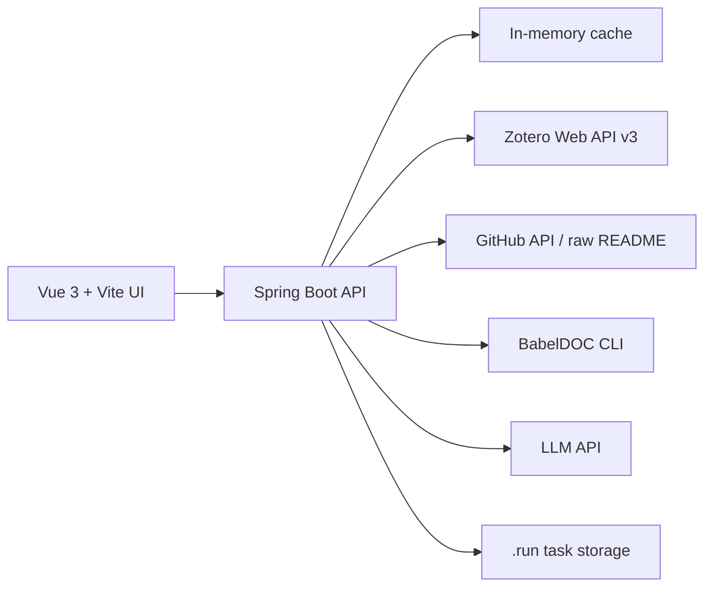

# Research Workbench

一个面向个人研究流程的全栈工具台：把 Zotero 文献库、论文 PDF 翻译、论文到 PPT 生成、GitHub 项目展示和 GitHub 项目展示整合到同一个站点中。


## What It Does

- **文献库展示**：从 Zotero Web API 拉取私有文献库，后端预热并缓存，前端按 collection、关键词和附件状态浏览。
- **附件代理与预览**：PDF/Markdown/网页快照附件统一由后端代理，支持 Zotero S3 跳转、ZIP 附件解包、流式传输和真实下载进度。
- **PDF 论文翻译**：上传 PDF 后选择页码范围、字体族和速度模式，由后端排队调用 BabelDOC 生成保留版式的纯中文 / 双语 PDF。
- **PPT 生成**：根据提示词、论文文件和可选 PPTX 模板生成答辩或汇报材料，支持论文图片抽取、视觉筛选和模板原生填充。
- **GitHub 项目展示**：前端只访问站内接口，后端代理 GitHub API 和 README raw 内容，避免浏览器直连外部接口。

## Screenshots

### Zotero Publications

文献页聚合 Zotero 条目、collection、标签、附件和引用导出。PDF 附件按需下载，避免一次性占用浏览器和 JVM 内存。


### PDF Translation

翻译页采用上传、配置、翻译中、结果预览四态流程。BabelDOC 负责保留论文版式、图片和公式位置。


### Paper To PPT

PPT 生成页支持提示词、论文和 PPTX 模板组合输入。任务在后端单 worker 队列中运行，完成后下载可编辑 `.pptx`。


## Architecture



The browser only talks to `/api/*`. External services, local CLIs, file downloads, authentication checks, queueing and resource limits live in the backend.

## Tech Stack

| Layer | Stack |
| --- | --- |
| Frontend | Vue 3, Vite, Naive UI, Pinia, Vue Router |
| Backend | Spring Boot 3, Java 17 |
| Documents | PDFBox, BabelDOC, python-pptx, Docling / MarkItDown fallback |
| Data Sources | Zotero Web API v3, GitHub API |
| Runtime | macOS/Linux shell scripts, `.env.local`, systemd-friendly release package |

## Repository Layout

```text
backen/                  Spring Boot backend (package: com.web.backen)
front/                   Vue 3 frontend
deploy/                  release build, install and server templates
project.sh               local start / stop / status helper
.env.local.example       local environment template
.deploy.local.example    deployment parameter template
```

> The backend directory is intentionally named `backen`; the Java package is `com.web.backen`.

## Local Development

Requirements:

- Java 17
- Node.js + npm
- `uv` for BabelDOC / Python helper commands

```bash
cp .env.local.example .env.local
./project.sh start
```

Then open:

- Frontend: `http://localhost:3000`
- Backend: `http://localhost:8080`

Useful commands:

```bash
./project.sh status
./project.sh restart backend
./project.sh logs backend
./project.sh stop
```

## Configuration

Secrets are loaded from `.env.local`, which is intentionally ignored by Git.

Important groups:

- `ZOTERO_API_KEY`, `ZOTERO_USER_ID`
- `ADMIN_KEY`
- `LLM_*`
- `BABELDOC_*`
- `PPT_GENERATION_*`

Use `.env.local.example` as the public template and keep real API keys outside the repository.

## Resource Baseline

The production target is intentionally modest: **2 CPU cores / 4 GB RAM**. Long-running work uses bounded queues, single-worker document generation, disk-backed task files, streaming attachment transfer and conservative concurrency defaults.

## Deployment

Build a Linux release archive:

```bash
./deploy/build-release.sh
```

Run the improved deploy flow after local verification:

```bash
./deploy/deploy-server-improved.sh
```

Deployment-specific host, SSH and remote path values belong in `.deploy.local`.

## Git Hygiene

Only `README.md` is intended to be published as a root-level Markdown document. Internal maintenance notes, worklogs, local release folders, generated outputs, runtime state and secrets are ignored.

Ignored local/generated paths include:

- root-level Markdown except `README.md`
- `.run/`
- `.release/`
- `server-upload/`
- `outputs/`
- `.env.local`
- `.deploy.local`
