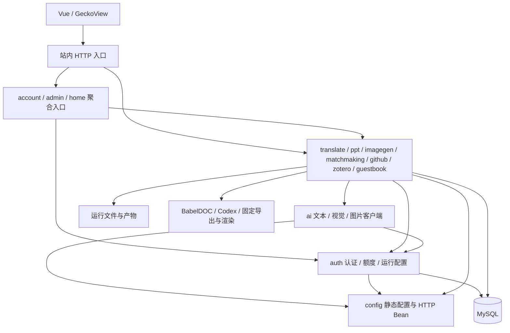

# 架构现状与优化路线

评估日期：2026-09-11。基线为 `6929b3b` 与 `codex/architecture-optimization` 首轮改动；原工作区未提交的关系探索功能不计入本轮构建。操作规范见 [工作流](WORKFLOW.md)，首轮范围与验证记录见 [实施计划](plans/2026-09-11-architecture-optimization.md)。

## 架构判断

建议继续采用模块化单体：一个 Spring Boot 应用负责鉴权、计费、任务管理和外部调用，Vue 与 Android 共用站内 API。当前单实例、2核/4GB主机以及已有 SQL 事务边界，适合先收紧内部依赖、恢复和资源控制。引入独立微服务、消息中间件或多副本 worker 会增加数据协调与运行资源成本，目前没有混合负载证据支持这种扩展。

已有基础值得保留：前端路由懒加载、同源 API 与 HttpOnly 会话、后端有界单 worker 队列、任务权限、婚恋 SQL 事务和可重试补偿、Zotero 完整快照发布、PPT 固定导出/真实渲染/质量门、GeckoView 可信源桥接。优化应围绕这些边界演进。

## 首轮落地后的模块关系（历史基线）

下图表达主要允许依赖，不是所有类的调用图；箭头由调用方指向依赖方。

| 边界 | 本轮改动 | 保持的契约 |
| --- | --- | --- |
| 账号与后台聚合 | `AuthController` → `account`；`AdminAccountController` → `admin` | `/api/auth/*`、`/api/admin/accounts/*`、CSRF、root、内测即时失效 |
| 公共 AI 传输 | `translate.LlmService` → `ai.LlmClient`；`OpenAiImageClient` → `ai` | 在用文本/视觉/生图方法、请求预算和重试；领域提示词继续由业务模块持有 |
| PPT 与演示素材库 | 发布不可变 `PresentationImageGalleryService.Publication` | 素材库文件格式、归属、去重、历史保留与 root 审计权限 |
| 历史耦合 | 删除 PPT 构造函数未使用的 LLM 参数；移除无人调用的旧段落翻译方法及提示词 | BabelDOC PDF 翻译和图片视觉翻译入口不变 |
| 防止依赖回退 | Maven test 中增加 ArchUnit | 顶层包无循环、基础层不依赖业务/聚合、代码不调用 HTTP 控制器 |

修复前，`auth` 聚合控制器反向调用多个依赖 `auth` 的业务模块；`imagegen` 素材库又直接读取 PPT 任务对象，形成循环。拆分后控制器继续在 `com.web.backen` 的 Spring 扫描树中，基础服务无需了解某个业务页面的聚合需求。图库拥有自己的输入契约，PPT 调用端负责从任务提取必要数据；不传入扣费、进度、访问令牌等无关字段。

协议回归还复现了默认凭据混入跨 provider 请求的问题。`LlmClient` 现在从原 RestClient 派生副本，清理默认 `Authorization`、`x-api-key` 和 `anthropic-version`，再按每次请求赋值；不修改原 Bean 的超时、其他默认头和配置。这里的隔离是凭据隔离，不是新的网络沙箱。

架构检查使用仅测试范围的 [ArchUnit](https://www.archunit.org/userguide/html/000_Index.html#_cycle_checks)，不会增加生产常驻进程。它验证编译期依赖，不证明运行时事务、资源或权限正确；这些仍依靠业务测试和真实验收。

## 路线状态与后续边界

下表保留2026-09-11评估时的风险和验收目标，并标记当前落地范围；已实现的协调和恢复能力仍不等同于生产容量结论。

| 优先级 | 证据与问题 | 建议范围 | 验收条件 |
| --- | --- | --- | --- |
| P1：全站接单与资源协调（已落地） | 各模块单 worker 仍可能同时运行 | 进程内统一接单状态与重任务许可已保留各领域队列，未增加并发；实测10页BabelDOC完成两段合并与下载渲染 | 仍需与PPT、图片同时运行的混合负载，记录RSS、cgroup、Swap、等待/取消/超时 |
| P1：任务恢复与扣费证据一致性（已强化） | 婚恋使用SQL，其他领域使用磁盘快照配合SQL流水 | 原子快照、待补偿保护、写盘失败重试与MySQL退款并发验证已完成 | PPT/生图跨SQL与文件的更多故障组合仍应在变更时扩展 |
| P1：发布排空与数据恢复（已落地） | 原流程未扫描全领域或备份运行证据 | 四模块接单关闭、任务/补偿扫描、SQL+运行文件+配置备份和阶段化恢复已纳入发布 | 专用2核/4GB VM已演练活动/损坏/待补偿、备份失败与安装失败；生产发布另行授权 |
| P2：前端任务生命周期（已落地） | 原有轮询与SSE清理规则不一致 | 四页面已使用可取消串行观察器；PPT保留SSE，并在切换/卸载时取消预览请求和释放Blob URL | 真实服务断网、401/403/404仍应随鉴权改动回归 |
| P2：页面职责与API契约（已拆分） | 页面和集中API曾承担过多职责 | API已按领域再导出；PPT进度、预览、编辑器及后台账号/provider设置已独立 | 继续按具体业务职责拆分，保持路由、幂等键、sandbox和错误码 |
| P2：配置与外部进程边界（已落地） | 配置、路径与进程树退出曾分散 | `settings`、`runtime`、存储根、进程树回收和视觉配置已分责；JDBC驱动跟随URL。BabelDOC提前保护为2400MiB，systemd软限制为2600M，硬限制保持2800M | 修改外部程序或数据库配置时复验macOS/Linux和真实产物 |
| P2：自动化与可观测性（已落地本地门禁） | 本地测试无法证明远端执行 | CI工作流、受root保护的运行概况与发布验证已具备 | CI尚未在远端仓库运行，指标仍不得含用户私有数据 |

上述持久化条目描述的是当前实现边界及需要故障验证的风险，不表示本轮已经证明发生了丢单或扣费事故。资源条目也不代表测得当前四类任务同时运行必然OOM；真实负载数据是调整并发前的必要依据。

## 推荐实施顺序

1. 本轮模块依赖与契约测试合入后，先做统一接单/排空，再把发布备份和恢复补齐。两者共用可查询的任务活动/待补偿视图，但公开首页不接收私有任务信息。
2. 对其余三类任务逐一补故障注入，再选择 SQL 台账迁移或强化当前快照协议。婚恋的SQL恢复与退款凭据作为已有实现保留，领域状态仍分别建模。
3. 统一前端观察器，然后按职责拆分PPT和后台页面；这样后续UI改动能复用已验证的连接生命周期。
4. 根据混合负载与运行指标决定是否拆出独立worker。多副本还需任务租约、去重、分布式限额、共享产物存储与删除互斥，不能只把线程池替换为消息队列。

不建议为了目录整齐而把四类任务继承同一个超大基类，或一次性重写所有Service。优先复用接单、观测、存储接口等稳定能力，各领域保留自己的完成条件、扣费补偿和产物校验。

## 证据导航

- 执行与恢复：[TranslationService](../backen/src/main/java/com/web/backen/translate/TranslationService.java)、[PptGenerationService](../backen/src/main/java/com/web/backen/ppt/PptGenerationService.java)、[ImageGenerationService](../backen/src/main/java/com/web/backen/imagegen/ImageGenerationService.java)、[MatchmakingService](../backen/src/main/java/com/web/backen/matchmaking/MatchmakingService.java)。
- 数据边界：[QuotaService](../backen/src/main/java/com/web/backen/auth/QuotaService.java)、[schema.sql](../backen/src/main/resources/schema.sql)、[ZoteroCache](../backen/src/main/java/com/web/backen/zotero/ZoteroCache.java)。
- 前端：[PPT页面](../front/src/views/PptGenerate/index.vue)、[翻译页面](../front/src/views/Translate/index.vue)、[图片页面](../front/src/views/ImageGenerate/index.vue)、[后台页面](../front/src/views/Admin/index.vue)、[请求工具](../front/src/utils/request.js)、[现有轮询器](../front/src/utils/taskPoller.js)。
- 运维：[发布脚本](../deploy/deploy-server-improved.sh)、[部署与恢复](../DEPLOYMENT.md)、[Android边界](../android/README.md)、[应用配置](../backen/src/main/resources/application.yml)。

## 集成与交付边界

本轮没有改数据库格式、生产配置、资源阈值、前端或Android，也没有部署。分支中的Java类型变更需 clean 构建清除旧class。

与原工作区关系探索改动合并时，检查新加的 `RelationshipReportAgent` 及相关测试：原 `com.web.backen.translate.LlmService` 引用改为 `com.web.backen.ai.LlmClient`；原 `com.web.backen.imagegen.OpenAiImageClient` 引用改为 `com.web.backen.ai.OpenAiImageClient`。在合并后的完整源码上重新运行测试，本分支通过不等于未提交功能已被验收。

## 第二批实施状态（2026-09-11）

`settings.RuntimeConfigService` 已从认证包独立；`runtime` 提供路径解析、进程树退出、原子快照及单实例资源许可。四类创建入口共享维护锁；root 可通过 `/api/admin/operations` 查看汇总，通过带 CSRF 的 `PUT /api/admin/operations/admission` 提交 `{"action":"pause"}` 或 `{"action":"resume"}`。管理员不能移除发布流程持有的锁。重任务许可为1，JVM AI HTTP客户端许可为2；后者不统计 Codex/BabelDOC 自己发出的网络请求，也不是分布式限流。

翻译/PPT/生图的写盘失败会保留待补偿证据，定时重试持久化与退款；清理排除待补偿、未持久化和仍在退出的任务。损坏快照阻止启动，原始文件保留供恢复。停机中断标记不会阻止已取消任务保存快照，随后恢复中断标记。婚恋继续使用 SQL 恢复协议。

前端 API 已按九个领域拆分并保留索引再导出；四类任务使用可取消串行轮询，终态仍有补偿时继续查询。PPT保留SSE进度提示；翻译和生图用状态接口恢复进度。预览请求切换/卸载时取消。

本批已加入四模块发布扫描、SQL/运行文件/配置备份和CI工作流；后台账号/provider与PPT预览/编辑器已按职责拆分。专用2核/4GB Linux VM已完成完整部署恢复演练、实际导出并渲染三页PPTX，以及10页BabelDOC两段合并、下载和渲染。PPT/图片同时运行的混合负载、远端CI与生产验收仍按[完整实施计划](plans/2026-09-11-architecture-completion.md)推进；未部署。
