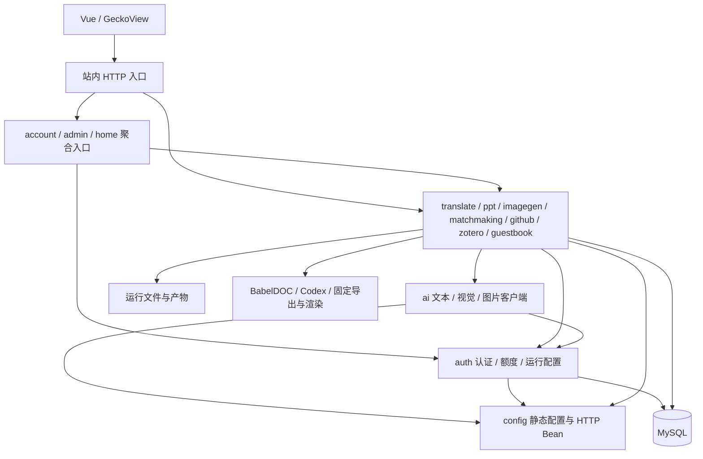

# 架构现状与优化路线

评估日期：2026-09-11。基线为 `6929b3b` 与 `codex/architecture-optimization` 首轮改动；原工作区未提交的关系探索功能不计入本轮构建。操作规范见 [工作流](WORKFLOW.md)，首轮范围与验证记录见 [实施计划](plans/2026-09-11-architecture-optimization.md)。

## 架构判断

建议继续采用模块化单体：一个 Spring Boot 应用负责鉴权、计费、任务管理和外部调用，Vue 与 Android 共用站内 API。当前单实例、2核/4GB主机以及已有 SQL 事务边界，适合先收紧内部依赖、恢复和资源控制。引入独立微服务、消息中间件或多副本 worker 会增加数据协调与运行资源成本，目前没有混合负载证据支持这种扩展。

已有基础值得保留：前端路由懒加载、同源 API 与 HttpOnly 会话、后端有界单 worker 队列、任务权限、婚恋 SQL 事务和可重试补偿、Zotero 完整快照发布、PPT 固定导出/真实渲染/质量门、GeckoView 可信源桥接。优化应围绕这些边界演进。

## 首轮落地后的模块关系

下图表达主要允许依赖，不是所有类的调用图；箭头由调用方指向依赖方。

| 边界 | 本轮改动 | 保持的契约 |
| --- | --- | --- |
| 账号与后台聚合 | `AuthController` → `account`；`AdminAccountController` → `admin` | `/api/auth/*`、`/api/admin/accounts/*`、CSRF、root、内测即时失效 |
| 公共 AI 传输 | `translate.LlmService` → `ai.LlmClient`；`OpenAiImageClient` → `ai` | 在用文本/视觉/生图方法、请求预算和重试；领域提示词继续由业务模块持有 |
| PPT 与演示素材库 | 发布不可变 `PresentationImageGalleryService.Publication` | 素材库文件格式、归属、去重、历史保留与 root 审计权限 |
| 历史耦合 | 删除 PPT 构造函数未使用的 LLM 参数；移除无人调用的旧段落翻译方法及提示词 | BabelDOC PDF 翻译和图片视觉翻译入口不变 |
| 防止依赖回退 | Maven test 中增加 ArchUnit | 顶层包无循环、基础层不依赖业务/聚合、代码不调用 HTTP 控制器 |

修复前，`auth` 聚合控制器反向调用多个依赖 `auth` 的业务模块；`imagegen` 素材库又直接读取 PPT 任务对象，形成循环。拆分后控制器继续在 `com.web.backen` 的 Spring 扫描树中，基础服务无需了解某个业务页面的聚合需求。图库拥有自己的输入契约，PPT 调用端负责从任务提取必要数据；不传入扣费、进度、访问令牌等无关字段。

协议回归还复现了默认凭据混入跨 provider 请求的问题。`LlmClient` 现在从原 RestClient 派生副本，清理默认 `Authorization`、`x-api-key` 和 `anthropic-version`，再按每次请求赋值；不修改原 Bean 的超时、其他默认头和配置。这里的隔离是凭据隔离，不是新的网络沙箱。

架构检查使用仅测试范围的 [ArchUnit](https://www.archunit.org/userguide/html/000_Index.html#_cycle_checks)，不会增加生产常驻进程。它验证编译期依赖，不证明运行时事务、资源或权限正确；这些仍依靠业务测试和真实验收。

## 后续优先级

以下均为待实施建议，不能按已实现能力使用。

| 优先级 | 证据与问题 | 建议范围 | 验收条件 |
| --- | --- | --- | --- |
| P1：全站接单与资源协调 | 翻译、PPT、生图分别创建线程池，婚恋独立线程；各模块单 worker 仍可能同时运行。资源保护主要集中在 BabelDOC | 增加进程内统一接单状态与重任务许可，保留各领域队列；按阶段区分本地渲染、PDF 与网络调用，不直接增加并发 | 在2核/4GB环境运行真实PDF多分片+PPT渲染+图片请求混合负载；记录RSS、cgroup、Swap、等待/取消/超时；所有退出路径释放许可 |
| P1：任务恢复与扣费证据一致性 | 婚恋用SQL任务；其他任务用磁盘快照配合SQL流水。翻译保存元数据失败只记日志；生图创建失败路径同时处理退款和目录清理 | 先逐模块抽出 repository 与失败补偿接口，故障注入验证“扣费成功但快照失败”；再评估把任务台账逐模块迁入SQL，产物留磁盘 | 隔离MySQL验证创建/扣费原子性、确认丢失、重启、并发取消/删除、退款失败与证据保留；兼容旧任务、历史产物和过期策略 |
| P1：发布排空与数据恢复 | 标准发布脚本只扫描翻译/PPT磁盘活动项，代码备份排除`.run`，没有SQL一致备份；文档已明确这些缺口 | 将四模块接单关闭、活动/待补偿状态、停服复核、SQL+运行文件备份和恢复阶段纳入标准发布流程 | 模拟任务进行中、损坏快照、SQL备份失败、安装失败、新版写入后恢复与统计失败；不能只凭health决定成功 |
| P2：前端任务生命周期 | PPT用SSE及`setInterval`轮询；翻译使用未保存句柄的重连`setTimeout`；图片SSE失败后关闭，仅加载一次历史；现有`taskPoller`只认识婚恋终态 | 先提取可配置终态/补偿判定的任务观察器，统一串行请求、AbortController、超时退避、切换任务与卸载处理，再逐页接入 | 慢响应、断网恢复、401/403/404、切任务、卸载、取消、补偿未完成；真实浏览器及受影响390/320px页面 |
| P2：页面职责与API契约 | PPT页面约3187行、后台约2579行；`api/index.js`集中约773行。大量`Map<String,Object>`跨端字段靠人工一致 | API按领域拆文件并暂保留索引再导出；PPT按提交/进度/预览编辑/历史拆组件与组合函数；后台按账号/额度/provider设置拆分。写接口先用明确DTO与服务端校验 | 保持路由、序列化字段、幂等键和错误码；契约测试与桌面/移动交互回归，iframe sandbox/DOMPurify/Blob释放保留 |
| P2：配置与外部进程边界 | 运行配置集中在`auth.RuntimeConfigService`；图片翻译还读取`PptGenerationConfig`视觉参数；任务/图库路径有工作目录假设；进程树回收逻辑分散 | 按职责逐步抽出settings/存储根/受控进程执行能力，保留现有环境变量别名与实际目录；先聚合观测信息，后提取实现 | 旧配置兼容、macOS/Linux、工作目录变化、超时/中断/进程树退出；真实PPT/PDF产物质量门通过 |
| P2：自动化与可观测性 | 有本地测试/发布门禁，无仓库CI工作流；`/api/health`仅返回应用响应，首页任务时间不涵盖婚恋 | 在本地门禁稳定后接CI；另做受root保护的任务/补偿/worker概况，公开健康仅返回必要状态 | CI不带生产凭据；发布前按需运行隔离MySQL与真实产物套件；指标不含问卷、提示词、文件名或访问凭据 |

上述持久化条目描述的是当前实现边界及需要故障验证的风险，不表示本轮已经证明发生了丢单或扣费事故。资源条目也不代表测得当前四类任务同时运行必然OOM；真实负载数据是调整并发前的必要依据。

## 推荐实施顺序

1. 本轮模块依赖与契约测试合入后，先做统一接单/排空，再把发布备份和恢复补齐。两者共用可查询的任务活动/待补偿视图，但公开首页不接收私有任务信息。
2. 对其余三类任务逐一补故障注入，再选择 SQL 台账迁移或强化当前快照协议。婚恋的SQL恢复与退款凭据作为已有实现保留，领域状态仍分别建模。
3. 统一前端观察器，然后按职责拆分PPT和后台页面；这样后续UI改动能复用已验证的连接生命周期。
4. 根据混合负载与运行指标决定是否拆出独立worker。多副本还需任务租约、去重、分布式限额、共享产物存储与删除互斥，不能只把线程池替换为消息队列。

不建议为了目录整齐而把四类任务继承同一个超大基类，或一次性重写所有Service。优先复用接单、观测、存储接口等稳定能力，各领域保留自己的完成条件、扣费补偿和产物校验。

## 证据导航

- 执行与恢复：[TranslationService](../backen/src/main/java/com/web/backen/translate/TranslationService.java)、[PptGenerationService](../backen/src/main/java/com/web/backen/ppt/PptGenerationService.java)、[ImageGenerationService](../backen/src/main/java/com/web/backen/imagegen/ImageGenerationService.java)、[MatchmakingService](../backen/src/main/java/com/web/backen/matchmaking/MatchmakingService.java)。
- 数据边界：[QuotaService](../backen/src/main/java/com/web/backen/auth/QuotaService.java)、[schema.sql](../backen/src/main/resources/schema.sql)、[ZoteroCache](../backen/src/main/java/com/web/backen/zotero/ZoteroCache.java)。
- 前端：[PPT页面](../front/src/views/PptGenerate/index.vue)、[翻译页面](../front/src/views/Translate/index.vue)、[图片页面](../front/src/views/ImageGenerate/index.vue)、[后台页面](../front/src/views/Admin/index.vue)、[请求工具](../front/src/utils/request.js)、[现有轮询器](../front/src/utils/taskPoller.js)。
- 运维：[发布脚本](../deploy/deploy-server-improved.sh)、[部署与恢复](../DEPLOYMENT.md)、[Android边界](../android/README.md)、[应用配置](../backen/src/main/resources/application.yml)。

## 集成与交付边界

本轮没有改数据库格式、生产配置、资源阈值、前端或Android，也没有部署。分支中的Java类型变更需 clean 构建清除旧class。

与原工作区关系探索改动合并时，检查新加的 `RelationshipReportAgent` 及相关测试：原 `com.web.backen.translate.LlmService` 引用改为 `com.web.backen.ai.LlmClient`；原 `com.web.backen.imagegen.OpenAiImageClient` 引用改为 `com.web.backen.ai.OpenAiImageClient`。在合并后的完整源码上重新运行测试，本分支通过不等于未提交功能已被验收。
