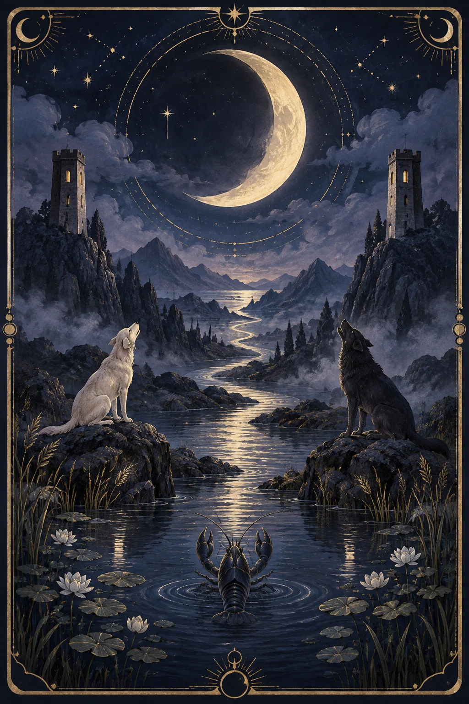
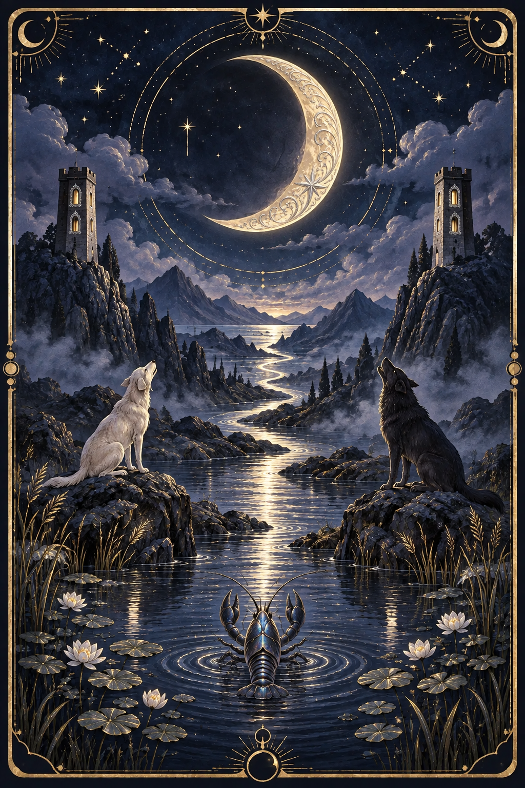
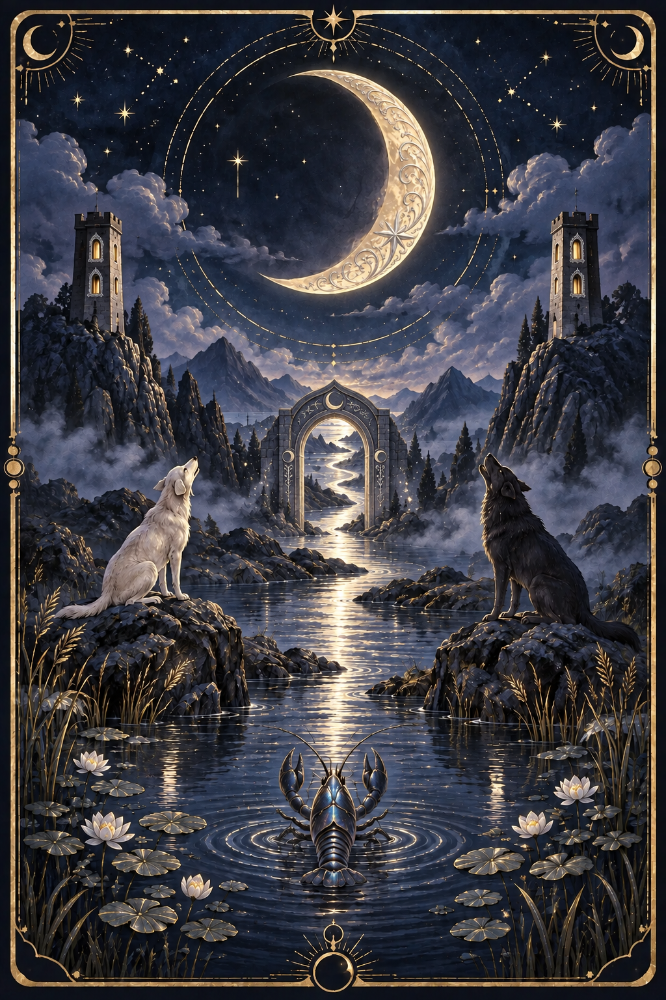
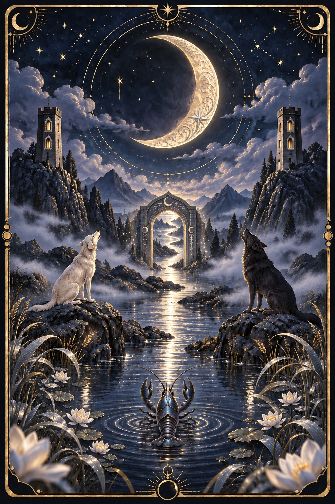

# 月亮五级静态打样 v01

状态：Lv.2–Lv.4 已生成候选，待用户审美确认；Lv.5 被生图额度限制阻断，未生成。网站原图保持不变。

采用内置 image_gen；实际提示词见 [prompts.json](prompts.json)，输入/输出哈希见 [manifest.json](manifest.json)。

## Lv.1 初见：原图

## Lv.2 微光：月轮雕花、塔窗银边、蓝银甲壳

## Lv.3 共鸣：水路上的月弧石门

## Lv.4 幻境：近景睡莲、银蓝芦叶与薄雾

## Lv.5 典藏：待生成

计划展开门后银色水庭，增加门影与月相水纹边框。请求返回 usage_limit_reached，不能将 Lv.4 视为 Lv.5 成品。

## 审查与后续

- 三张候选均为1024×1536不透明PNG，非分层素材、非动画。
- 目视核对弯月、双塔、左白犬右黑犬、甲壳动物与水路保留；Lv.2整体对比度也有所提高，Lv.3月门比草案更醒目，作为审美待确认项保留。
- Lv.4以新增前景与雾展示静态景深；真实互动需后续拆层、补背景和浏览器验收。
- 本次Lv.3使用Lv.2作为编辑目标，Lv.5计划使用Lv.4，目的是累积已解锁细节；这是实际打样输入链，区别于初始44条通用任务的简化A/B引用。
- 额度恢复后使用已保存的Lv.5提示词和清单中的输入图继续；不覆盖候选v01，不自动生成其余牌。
